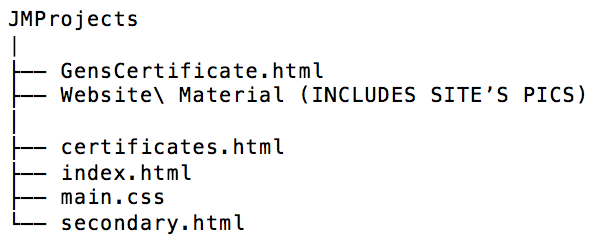

# JMProjects - Juan Moctezuma's Projects

### Introduction
This site contains a brief description about the author's original projects within the 'Home' page. 
Information regarding skills or abilities and certificates are found on the About Me and Certificates 
pages respectively. This website served as the author's portfolio during 02/2018 - 04/2019; and not every 
project is exclusively related with software engineering. If you are interested in looking at the author's 
most recent portfolio, please click the link below:

Official Portfolio: https://juan-moctezuma.github.io/Official_Developer_Portfolio/

### Link
Github Website: https://juan-moctezuma.github.io/JMProjects/

### Does the code require a local web server to run?
No.

### Directory Tree

### Technologies
1. HTML5
2. CSS3:
   * Responsive Framework: Bootstrap 4
3. Vanilla JavaScript (Embedded within index.html)
